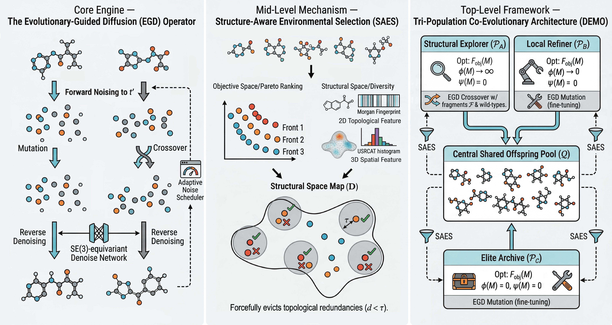

# Diffusion-based Evolutionary Optimization for 3D Multi-Objective Molecular Generation

[](https://arxiv.org/abs/2505.11037)



Official code release for the paper **"Diffusion-based Evolutionary Optimization for 3D Multi-Objective Molecular Generation"**.

This repository provides the implementation of **DEMO**, a zero-shot optimization framework that bridges the global search capabilities of Evolutionary Algorithms (EAs) with the physical validity of 3D diffusion models to solve complex Constrained Multi-Objective Optimization Problems (CMOPs) in 3D molecular design.

## Environment Installation

Create a new conda environment and install the required packages:

### Example environment creation
```conda create -n demo_env python=3.9```
```conda activate demo_env```

### Install requirements
```pip install -r requirements.txt```

## Quick Start

Once the environment is set up, the evaluation scripts are ready to run out-of-the-box. We have categorized the scripts according to the different experimental tasks presented in the paper.
### 0. Background Generation (Optional but Recommended)

If you want to generate the 100k background molecular samples for unconditional data distribution comparisons, please run task0 first:
code Bash

```python task0_GeoLDM_UnCond_gen.py```

### 1. Single-Property Targeting

Scripts to evaluate the core EGD operator on precisely matching scalar property values:

    task2_single_target_matching_MAE.py: EGD single-property optimization.

    task2_single_target_matching_MAE_topn.py: Top-N passive sampling baseline.

### 2. Multi-Property Targeting & Unconstrained MOP

Scripts to discover the Pareto trade-off front without predefined scalarization weights:

    task4_dual_pareto_optimize_DEMO.py: The proposed framework utilizing SAES.

    task4_dual_pareto_optimize.py / task4_dual_pareto_optimize_topn.py: Baselines and traditional EMO evaluations.

### 3. 3D Protein-Ligand Docking MOP

Scripts for optimizing multiple properties (e.g., Vina score, QED, SA) within specific protein pockets:

    task5_drugs_MOP_DEMO.py: The proposed DEMO framework for docking optimization.

    task5_drugs_MOP.py / task5_drugs_MOP_topn.py: Baseline evaluations for the docking task.

### 4. Constrained MOP (Multi-Fragment Assembly)

Scripts for the highly constrained multi-fragment assembly task (CMOP), utilizing the Tri-Population architecture:

    task8_dual_pareto_optimize_multi_patt1_DEMO.py: The full DEMO framework maintaining strict constraint feasibility and high structural diversity.

    task8_dual_pareto_optimize_multi_patt1_CCMO.py

    task8_dual_pareto_optimize_multi_patt1_CMOEACD.py

    task8_dual_pareto_optimize_multi_patt1_topn.py
    (Run the respective traditional CMOEA scripts above to compare structural diversity drops).

Citation

If you find our work helpful or use this code in your research, please consider citing our paper:
code Bibtex

@article{sun2025diffusion,
  title={Diffusion-based Evolutionary Optimization for 3D Multi-Objective Molecular Generation},
  author={Sun, Ruiqing and Feng, Dawei and Yang, Sen and Wang, Ronghang and Song, Huaiyuan and Ding, Bo and Wang, Yijie and Wang, Huaimin},
  journal={arXiv preprint arXiv:2505.11037},
  year={2025}
}

Acknowledgements

This repo is built upon the previous excellent work EDM and GeoLDM. We sincerely thank the authors for open-sourcing their codebases!